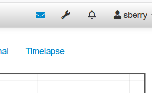
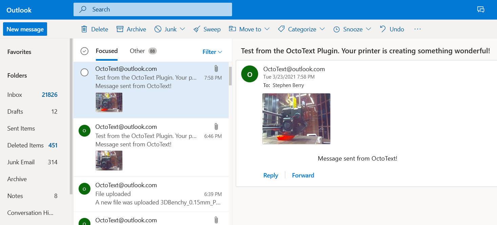

# OctoText - Simple, Easy to use, Free text or email notifications

OctoText will notify you via text (or email) on common printer events. The current list of events are:
<ul>
   <li> File uploaded</li>
   <li> Print started</li>
   <li> Print finished</li>
   <li> Print failure </li>
   <li> Print cancel </li>
   <li> Print pause </li>
   <li> Print resume </li>
   <li> Periodic progress updates </li>
   <li> Error (unrecoverable)</li>
</ul>

OctoText will also include a thumbnail of your print if <b> you have loaded [PrusaSlicer Thumbnails](https://github.com/jneilliii/OctoPrint-PrusaSlicerThumbnails)
or [Cura Thumbnails](https://github.com/jneilliii/OctoPrint-UltimakerFormatPackage) plugins</b>.
**This is a change from previous OctoText revisions where OctoText was handling the thumbnails directly.** 
Loading these plugins allows for a better interface with Cura and less redundancy for those that already use the
Prusa and Cura plugins. Just search for 'thumbnail' in the plugin manager to find them.

The thumbnail will only be sent on a print START event.

This release also introduces retries for network outages, where messages will retry for up to 5 minutes. 

An API was introduced in revision 0.3.1, but has been changed drastically. Please use the new API if you would like your
plugins to send custom messages through OctoText. An example plugin that shows how this works can be found 
here: [TextAPI](https://github.com/berrystephenw/OctoPrint-Textapi).

Print Pausing detects "waiting for user messages" that are sent by Prusa printers
on filament run out conditions.

A bug was fixed when webcams are enabled in OctoText, but the cam isn't working (for whatever reason) OctoText didn't send
any notifications. This has been changed so the text portion of the message is still sent along with
a friendly image telling you your webcam is down.

## Setup

Install via the bundled [Plugin Manager](https://docs.octoprint.org/en/master/bundledplugins/pluginmanager.html)
or manually using this URL:

    https://github.com/OctoText/OctoText/archive/refs/heads/main.zip

The plugin <b><i>requires a Python 3 installation in OctoPrint. </i></b>
If you have an older OctoPrint install and would like to upgrade (after checking to be sure your other plugins are Python 3 compatible) then you can do that by following the instructions here: https://community.octoprint.org/t/upgrade-your-octoprint-install-to-python-3/23973

## Configuration

In order to configure OctoText you have to use an email account to send the messages from.
I use the free email service from Microsoft - Outlook.com. I created the email address octotext@outlook.com for the development of the plugin
and it works well. You should NOT use an email account that you care about - the plugin may not be secure and while that will change in the future,
right now your password could be exposed to anyone that knows what to look for and has access to your machine.

Once you have the email account you want to use, you will need the SMTP server settings of that account. For Outlook you can find that under
Settings->sync settings:

In addition, you will also need to find out the email address of the text service of your mobile phone provider. For US carriers the list below will
cover most users:

In addition to this table, Xfinity Mobile uses mypixmessage.com for SMS/MMS gateway. This table was taken from: https://en.wikipedia.org/wiki/SMS_gateway please refer to Wikipedia for more up to date information.
Another resource for SMS gateways is the international site found here: https://sms-gateway-service.com/sms-gateway-by-country/

SSL and TLS protocols are supported - you must enable SSL if you need to use it for your provider (TLS is the default).

If you would rather receive email notifications in place of a text, then you should simply enter the username and host address in the
destination fields instead of the phone/gateway entries:

Once you have gathered all this information you will need to enter it into the settings page on OctoText. The envelope Icon on the OctoPrint front page
also doubles as a test message to check your settings. Just press it once and wait 30 seconds or so and you should see a text or email (if everything is set correctly)

### Sample images

 

 

# Problems?
If you are having trouble with your setup you can post on the discussion board, and I'll get to your question as soon as I can.
Please include a copy of the octoprint log from the logging menu of octoprint after enabling the DEBUG log level. https://github.com/OctoText/OctoText/discussions
# Credits
- Gina Häußge https://github.com/foosel for creating Octoprint and the plugin Pushbullet from which some of this plugin is developed from.
- jneilliii https://github.com/jneilliii for helping me get past some sticky problems in development
- Charlie Powell https://github.com/cp2004 for answering even the dumbest questions on discord.

